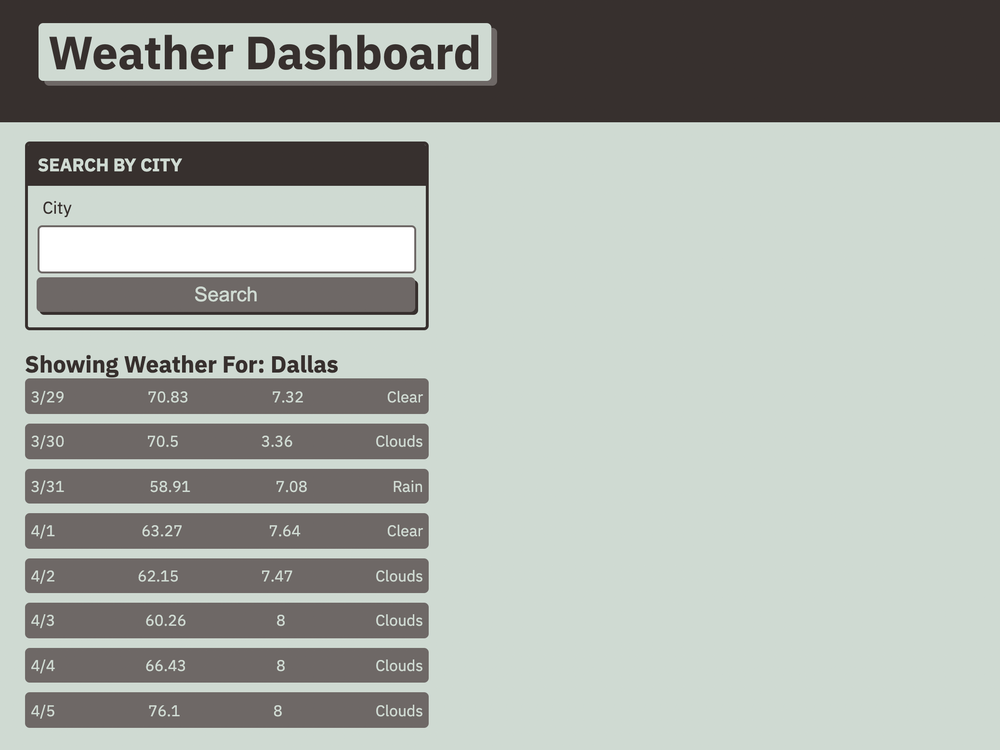

# Weather

Introduction: The purpose of the page is to help users plan for their holidays, weekends, or just a random tuesday! Merely by inputing a city  into the search bar our users will be able to see the date , temperature, UV index, and general weather forecast. So our users dont forget where they have searched, we have built in a saving mechanism. 

Technologies used:
o HTML
o CSS
o JavaScript

